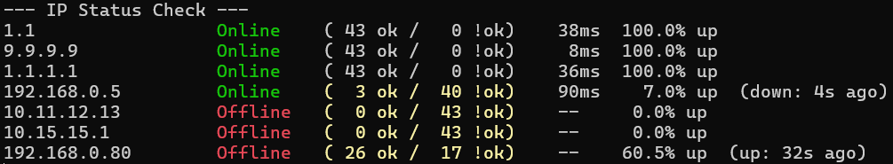

# pings

A lightweight command-line tool for monitoring multiple hosts with continuous ping checks and real-time status updates.

## Features

- 🎯 **Multi-host monitoring** - Ping multiple IP addresses simultaneously
- ⚡ **Concurrent pings** - All hosts are pinged in parallel for fast results
- 📊 **Success/failure tracking** - Count successful and failed pings over time
- ⏱️ **Latency measurement** - Display round-trip time of the last successful ping
- 📈 **Uptime percentage** - Calculate availability over time
- 🔄 **Status change tracking** - Show when hosts went online/offline
- 🔀 **Flexible sorting** - Sort output by online or offline hosts first
- 🎨 **Color-coded output** - Green for online, red for offline, yellow warnings
- 📁 **File input support** - Read IP addresses from a file
- ⚙️ **Configurable interval** - Adjust scan frequency (default: 5 seconds)
- 🖥️ **Cross-platform** - Works on Windows, Linux, and macOS

## Installation

### Download Precompiled Binaries

Download the latest release for your platform from the [Releases page](https://github.com/revlat/pings/releases).

Each release provides archives for multiple platforms:
- **Windows**: `pings-windows-amd64.zip` or `pings-windows-arm64.zip` (contains `pings.exe`)
- **Linux**: `pings-linux-amd64.tar.gz` or `pings-linux-arm64.tar.gz` (contains `pings`)
- **macOS**: `pings-darwin-amd64.tar.gz` (Intel) or `pings-darwin-arm64.tar.gz` (Apple Silicon, contains `pings`)

Extract the archive and run the binary directly.

### Build from Source

Requires [Go 1.24+](https://go.dev/dl/):

```sh
git clone https://github.com/revlat/pings.git
cd pings
go build -o pings .
```

On Windows, this creates `pings.exe`. On Linux/macOS, it creates `pings`.

## Usage

```
pings [OPTIONS] IP [IP ...] [INTERVAL]
pings [OPTIONS] FILE [INTERVAL]
```

Run `pings --help` for full usage information.

### Examples

**Monitor multiple IPs with default 5-second interval:**
```sh
pings 1.1.1.1 8.8.8.8 9.9.9.9
```

**Monitor with custom 10-second interval:**
```sh
pings 192.168.1.1 192.168.1.254 10
```

**Sort with offline hosts first:**
```sh
pings -s offline 192.168.1.1 192.168.1.2 192.168.1.3
```

**Sort with online hosts first:**
```sh
pings --sort online 192.168.1.1 192.168.1.2
```

**Read IPs from a file:**
```sh
# ip-list.txt contains one IP per line
pings ip-list.txt
```

**File input with sorting and custom interval:**
```sh
pings -s offline ip-list.txt 15
```

## Output Example



The output shows:
- **Green "Online"** - Host is reachable
- **Red "Offline"** - Host is unreachable
- **Counters** - `(5 ok / 0 !ok)` tracks successful and failed pings over time
- **Latency** - `12ms` shows round-trip time of the **last successful ping** (or `--` if currently offline)
- **Uptime** - `98.5% up` displays availability percentage since monitoring started
- **Status change** - Shows when status last changed:
  - `(down: 5s ago)` - Currently online, was offline 5 seconds ago
  - `(up: 2m 30s ago)` - Currently offline, was online 2 minutes and 30 seconds ago
  - `(down: 1h 5m 12s ago)` - Currently online, was offline 1 hour, 5 minutes, and 12 seconds ago
  - No indicator if status never changed
- **Yellow highlighting** - Indicates at least one failed ping for that host
- **Sorting** - Use `-s offline` to show offline hosts first, or `-s online` for online hosts first (default: original order)

## Notes

- **Windows users**: Use **PowerShell** or **Windows Terminal** for color support. `cmd.exe` may not display ANSI colors correctly.
- The tool clears the console between updates to provide a clean, real-time view.

## Building for Multiple Platforms

Using the included `Makefile`:

```sh
make build          # Build for current OS
make build-all      # Build for all platforms (output in build/)
make clean          # Clean build artifacts
```

Or manually with Go:

```sh
GOOS=windows GOARCH=amd64 go build -o pings-windows-amd64.exe .
GOOS=linux GOARCH=amd64 go build -o pings-linux-amd64 .
GOOS=darwin GOARCH=arm64 go build -o pings-darwin-arm64 .
```

## Technical Details

### Concurrent Ping Implementation

The tool uses **Go's goroutines** to ping all hosts in parallel, providing fast results even when monitoring many hosts:

- **Sequential approach**: 20 hosts × 1s timeout = ~20 seconds per scan
- **Concurrent approach**: 20 hosts in parallel = ~1-2 seconds per scan

All ping operations run concurrently, with thread-safe counters protected by mutex locks.

### Why String Parsing on Windows?

On **Linux/macOS**, the `ping` command reliably returns:
- Exit code `0` = Host is reachable
- Exit code `≠ 0` = Host is unreachable

On **Windows**, `ping.exe` returns **exit code 0 even when the host is unreachable** if an ICMP error response is received (e.g., "Destination net unreachable" from a router). Example:

```
C:\> ping 10.15.15.15
Reply from <router>: Destination net unreachable.
Exit code: 0
```

Therefore, this tool uses different detection methods per platform:

- **Windows**: Output parsing to detect actual reachability
  - Checks for successful reply: `"Reply from"` (EN) or `"Antwort von"` (DE)
  - Checks for error messages: `"unreachable"`, `"timed out"`, etc.
  - Supports both English and German Windows installations

- **Linux/macOS**: Exit code evaluation (reliable)

## License

MIT License - See [LICENSE](LICENSE) file for details.

## Contributing

Contributions are welcome! Please open an issue or submit a pull request.

