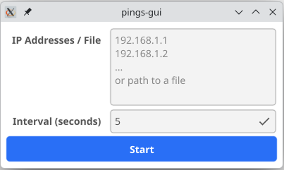
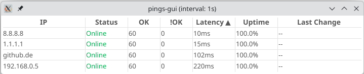

# pings

🇬🇧 [English](README.md) | 🇩🇪 [Deutsch](README_DE.md)

Leichtgewichtiges Tool zur Überwachung mehrerer Hosts mit kontinuierlichen Ping-Prüfungen und Echtzeit-Statusanzeige — verfügbar als **CLI** und grafische **GUI**.

## Features

- 🎯 **Multi-Host-Monitoring** - Mehrere IP-Adressen gleichzeitig pingen
- ⚡ **Parallele Pings** - Alle Hosts werden gleichzeitig angepingt für schnelle Ergebnisse
- 📊 **Erfolgs-/Fehleranzahl** - Erfolgreiche und fehlgeschlagene Pings über Zeit zählen
- ⏱️ **Latenz-Messung** - Round-Trip-Zeit des letzten erfolgreichen Pings anzeigen
- 📈 **Uptime-Prozentsatz** - Verfügbarkeit über Zeit berechnen
- 🔄 **Statusänderungs-Tracking** - Zeigt wann Hosts online/offline gegangen sind
- 🎨 **Farbkodierte Ausgabe** - Grün für online, rot für offline, gelbe Warnungen
- 📁 **Datei-Eingabe** - IP-Adressen aus einer Datei einlesen
- ⚙️ **Konfigurierbares Intervall** - Scan-Häufigkeit anpassen (Standard: 5 Sekunden)
- 🖥️ **Plattformübergreifend** - Funktioniert auf Windows, Linux und macOS
- 🪟 **GUI inklusive** - Optionale grafische Oberfläche mit sortierbarer Tabelle (`pings-gui`)

## Installation

### Vorkompilierte Binaries herunterladen

Die neueste Version für deine Plattform von der [Releases-Seite](https://github.com/revlat/pings/releases) herunterladen.

**CLI (`pings`)** — reines Go, keine Abhängigkeiten:

| Plattform | Archiv | Binary |
|-----------|--------|--------|
| Windows x64 | `pings-windows-amd64.zip` | `pings.exe` |
| Windows ARM64 | `pings-windows-arm64.zip` | `pings.exe` |
| Linux x64 | `pings-linux-amd64.tar.gz` | `pings` |
| Linux ARM64 | `pings-linux-arm64.tar.gz` | `pings` |
| macOS Intel | `pings-darwin-amd64.tar.gz` | `pings` |
| macOS Apple Silicon | `pings-darwin-arm64.tar.gz` | `pings` |

**GUI (`pings-gui`)** — benötigt eine Anzeige:

| Plattform | Archiv | Binary |
|-----------|--------|--------|
| Windows x64 | `pings-gui-windows-amd64.zip` | `pings-gui.exe` |
| Linux x64 | `pings-gui-linux-amd64.tar.gz` | `pings-gui` |
| Linux ARM64 | `pings-gui-linux-arm64.tar.gz` | `pings-gui` |
| macOS Apple Silicon | `pings-gui-darwin-arm64.tar.gz` | `pings-gui` |

Archiv entpacken und das Binary direkt ausführen.

### Aus Quellcode bauen

Benötigt [Go 1.24+](https://go.dev/dl/):

```sh
git clone https://github.com/revlat/pings.git
cd pings
make build        # CLI-Binary für aktuelles OS
make build-gui    # GUI-Binary für aktuelles OS (siehe Abhängigkeiten unten)
```

## CLI-Verwendung

```
pings [OPTIONS] IP [IP ...] [INTERVAL]
pings [OPTIONS] FILE [INTERVAL]
```

`pings --help` für alle Optionen.

### Beispiele

**Mehrere IPs mit Standard-5-Sekunden-Intervall überwachen:**
```sh
pings 1.1.1.1 8.8.8.8 9.9.9.9
```

**Mit benutzerdefiniertem 10-Sekunden-Intervall:**
```sh
pings 192.168.1.1 192.168.1.254 10
```

**Offline-Hosts zuerst sortieren:**
```sh
pings -s offline 192.168.1.1 192.168.1.2 192.168.1.3
```

**IPs aus einer Datei einlesen:**
```sh
pings ip-list.txt
```

## CLI-Ausgabe Beispiel


Die Ausgabe zeigt:
- **Grün "Online"** / **Rot "Offline"** - Aktuelle Erreichbarkeit
- **Zähler** - `(5 ok / 0 !ok)` zählt erfolgreiche und fehlgeschlagene Pings über Zeit
- **Latenz** - `12ms` Round-Trip-Zeit des letzten erfolgreichen Pings (oder `--` wenn offline)
- **Uptime** - `98.5% up` Verfügbarkeitsprozentsatz seit Monitoring-Start
- **Statusänderung** - `(down: 5s ago)` / `(up: 2m 30s ago)` — Zeit seit letztem Statuswechsel
- **Gelbe Hervorhebung** - Mindestens ein fehlgeschlagener Ping für diesen Host
- **Sortierung** - `-s offline` / `-s online` zum Umsortieren der Hosts

## pings-gui

`pings-gui` ist eine grafische Oberfläche mit derselben Monitoring-Engine wie die CLI. Es öffnet ein Fenster mit einer live-aktualisierten Tabelle.

### GUI-Verwendung

`pings-gui` akzeptiert dieselben Argumente wie `pings`.

```
pings-gui [OPTIONS] IP [IP ...] [INTERVAL]
pings-gui [OPTIONS] FILE [INTERVAL]
```

Wird `pings-gui` **ohne Argumente** gestartet, erscheint ein Eingabeformular zur interaktiven Eingabe von IP-Adressen und Scan-Intervall:



Nach Klick auf **Start** (oder bei Übergabe von IPs als Argumente) öffnet sich die Monitoring-Tabelle:



Die Tabellenspalten sind **sortierbar durch Klick auf den Spaltenkopf** — erneuter Klick kehrt die Reihenfolge um:

| Spalte | Beschreibung |
|--------|--------------|
| IP | Host-Adresse |
| Status | Online (grün) / Offline (rot) |
| OK | Anzahl erfolgreicher Pings |
| !OK | Anzahl fehlgeschlagener Pings (gelb wenn > 0) |
| Latency | Letzte Round-Trip-Zeit |
| Uptime | Verfügbarkeitsprozentsatz |
| Last Change | Zeit seit letztem Statuswechsel |

### pings-gui bauen

`pings-gui` verwendet [Fyne](https://fyne.io/) und benötigt **CGO** (einen C-Compiler). Zuerst die erforderlichen System-Bibliotheken installieren:

**Linux (Debian/Ubuntu):**
```sh
sudo apt-get install libgl1-mesa-dev libx11-dev libxrandr-dev libxcursor-dev \
  libxinerama-dev libxi-dev libxxf86vm-dev
```

**Linux (openSUSE):**
```sh
sudo zypper install libX11-devel Mesa-libGL-devel libXrandr-devel \
  libXcursor-devel libXinerama-devel libXi-devel libXxf86vm-devel
```

**Windows:** [MinGW-w64](https://www.mingw-w64.org/) installieren (z.B. via MSYS2 oder TDM-GCC) um `gcc` bereitzustellen.

**macOS:** Xcode Command Line Tools reichen aus:
```sh
xcode-select --install
```

Dann bauen:
```sh
make build-gui
```

## Hinweise

- **Windows-Nutzer (CLI)**: **PowerShell** oder **Windows Terminal** für Farb-Unterstützung verwenden. `cmd.exe` zeigt ANSI-Farben möglicherweise nicht korrekt an.
- Die CLI leert die Konsole zwischen Updates für eine saubere Echtzeit-Ansicht.

## Für alle Plattformen bauen

Mit dem enthaltenen `Makefile`:

```sh
make build          # CLI für aktuelles OS
make build-gui      # GUI für aktuelles OS
make build-all      # CLI für alle Plattformen (Ausgabe in build/)
make build-all-gui  # GUI für aktuelles OS nach build/
make clean          # Build-Artefakte bereinigen
```

## Technische Details

### Parallele Ping-Implementierung

Das Tool nutzt **Go-Goroutinen**, um alle Hosts gleichzeitig zu pingen — schnelle Ergebnisse auch bei vielen Hosts:

- **Sequenziell**: 20 Hosts × 1s Timeout = ~20 Sekunden pro Scan
- **Parallel**: 20 Hosts gleichzeitig = ~1-2 Sekunden pro Scan

Alle Ping-Operationen laufen parallel, Thread-sichere Zähler werden durch Mutex-Locks geschützt.

### Warum String-Parsing unter Windows?

Unter **Linux/macOS** gibt der `ping`-Befehl zuverlässig zurück:
- Exit-Code `0` = Host erreichbar
- Exit-Code `≠ 0` = Host nicht erreichbar

Unter **Windows** gibt `ping.exe` **Exit-Code 0 auch bei nicht erreichbaren Hosts** zurück, wenn eine ICMP-Fehlerantwort empfangen wird (z.B. "Destination net unreachable" von einem Router). Beispiel:

```
C:\> ping 10.15.15.15
Reply from <router>: Destination net unreachable.
Exit code: 0
```

Daher verwendet das Tool verschiedene Erkennungsmethoden je Plattform:

- **Windows**: Ausgabe-Parsing zur Erkennung der tatsächlichen Erreichbarkeit
  - Erkennt erfolgreiche Antwort: `"Reply from"` (EN) oder `"Antwort von"` (DE)
  - Erkennt Fehlermeldungen: `"unreachable"`, `"timed out"`, etc.
  - Unterstützt englische und deutsche Windows-Installationen

- **Linux/macOS**: Exit-Code-Auswertung (zuverlässig)

## Lizenz

MIT License - Siehe [LICENSE](LICENSE) für Details.
